# Supply chain & data auditing

This repository containts an Ethereum DApp that demonstrates a Supply Chain flow between a Seller and Buyer. The user story is similar to any commonly used supply chain process. A Seller can add items to the inventory system stored in the blockchain. A Buyer can purchase such items from the inventory system. Additionally a Seller can mark an item as Shipped, and similarly a Buyer can mark an item as Received.

The DApp User Interface when running should look like...

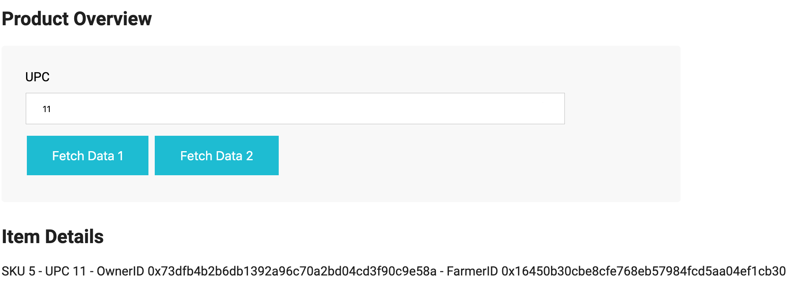

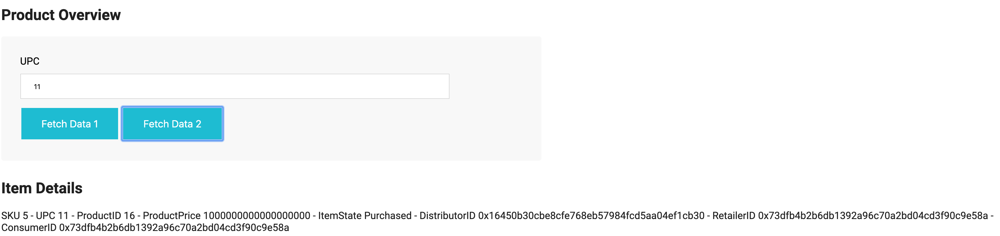

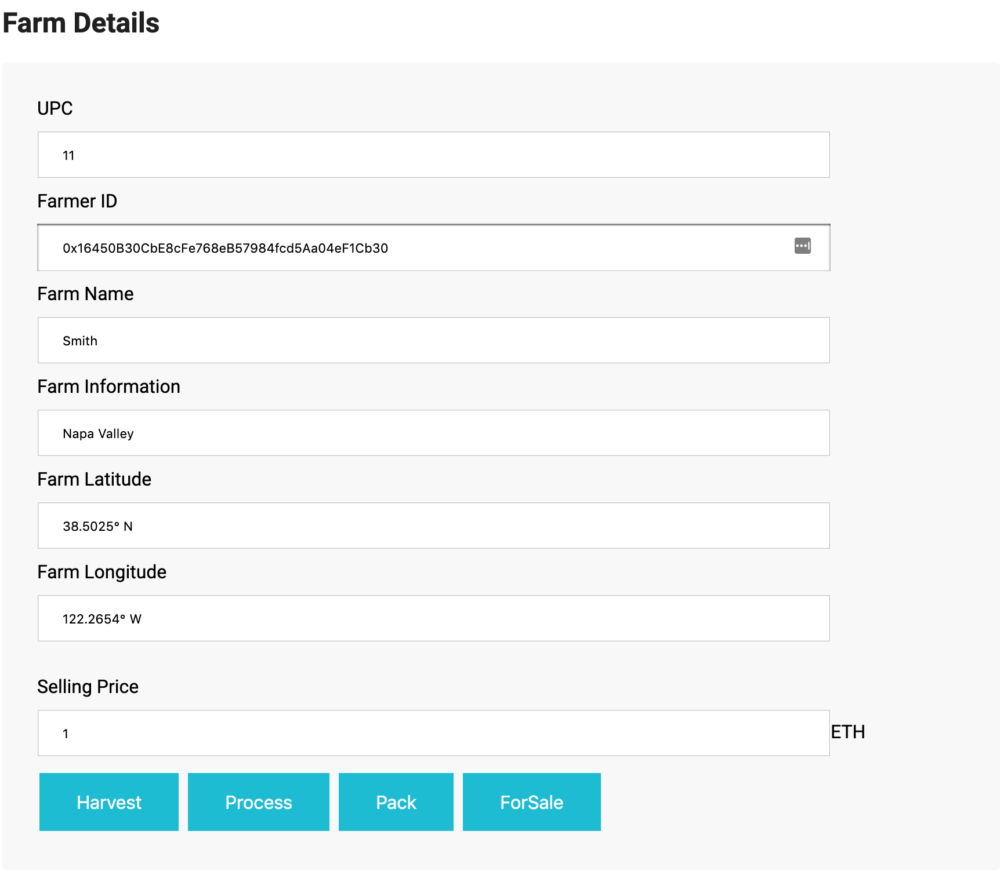

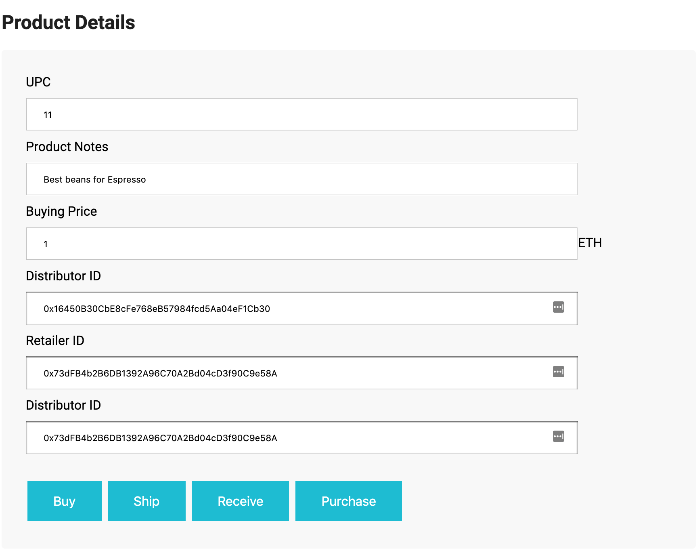

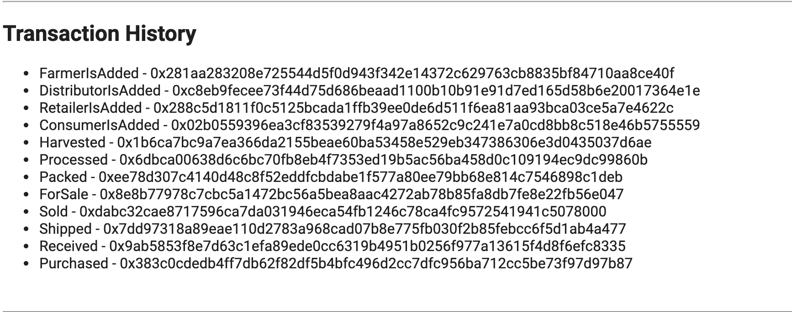


## Getting Started

These instructions will get you a copy of the project up and running on your local machine for development and testing purposes. See deployment for notes on how to deploy the project on a live system.

### Prerequisites

Please make sure you've already installed ganache-cli, Truffle and enabled MetaMask extension in your browser.

```
Give examples (to be clarified)
```

### Installing

A step by step series of examples that tell you have to get a development env running

Clone this repository:

```
git clone https://github.com/rpandey89/Coffee-Supply-Chain-Dapp.git
```

Change directory to ```project-6``` folder and install all requisite npm packages (as listed in ```package.json```):

```
cd project-6
npm install
```

Launch Ganache:

```
ganache-cli -m "spirit supply whale amount human item harsh scare congress discover talent hamster"
```

Your terminal should look something like this:

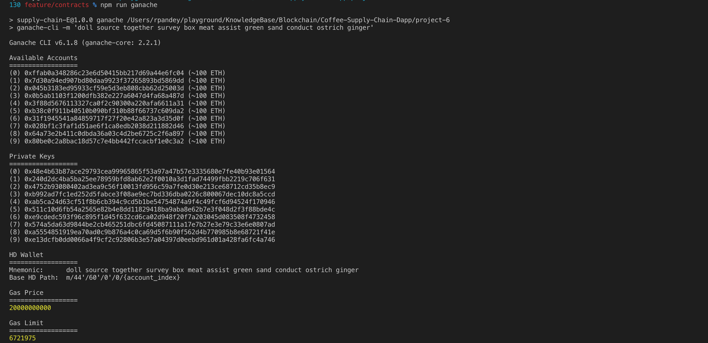

In a separate terminal window, Compile smart contracts:

```
truffle compile
```

Your terminal should look something like this:


This will create the smart contract artifacts in folder ```build\contracts```.

Migrate smart contracts to the locally running blockchain, ganache-cli:

```
truffle migrate
```

Your terminal should look something like this:

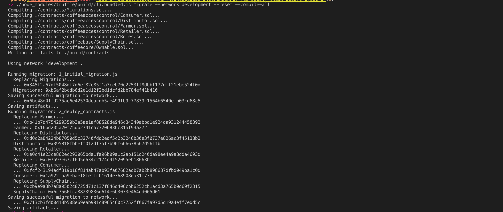

Test smart contracts:

```
truffle test
```

All 10 tests should pass.

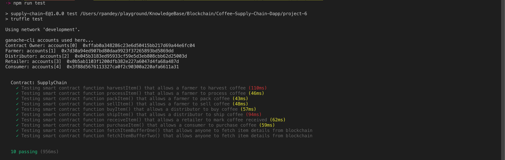

In a separate terminal window, launch the DApp:

```
npm run dev
```

#Architecture

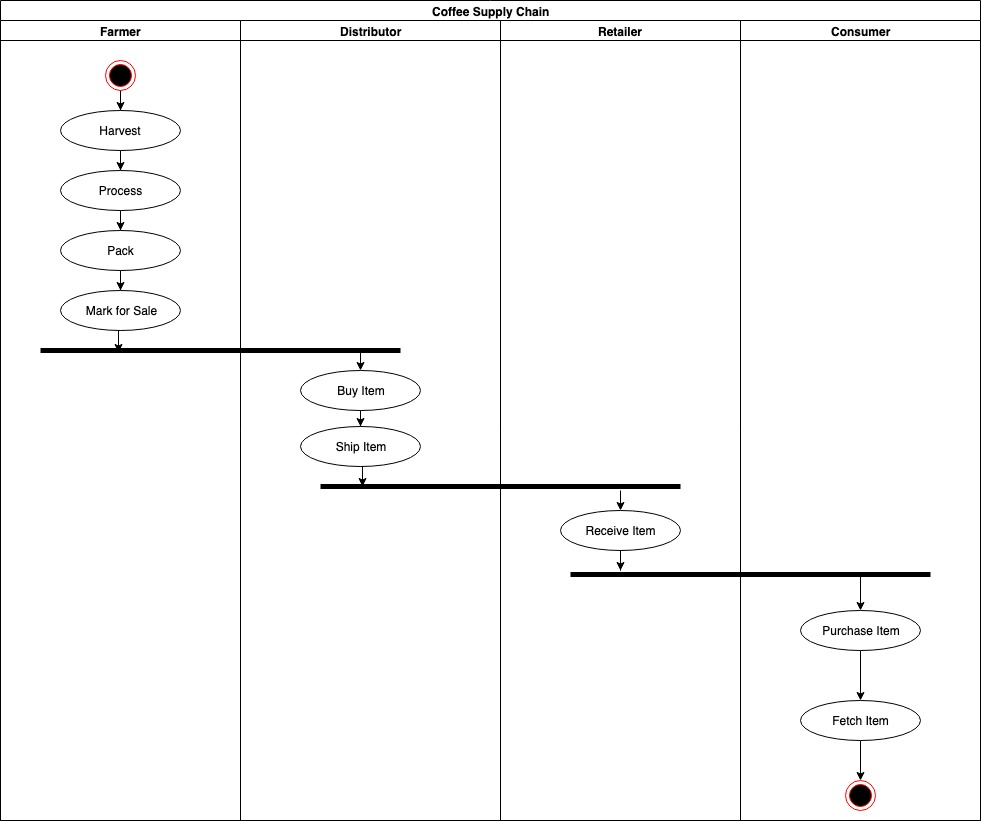

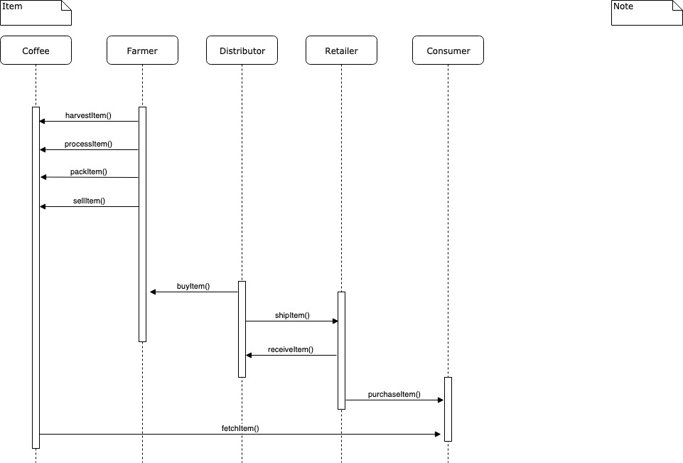


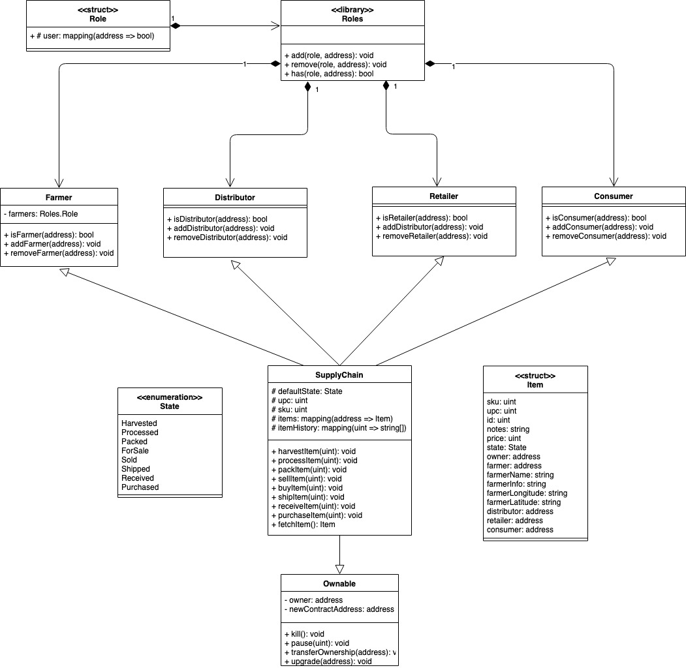

## Built With

* [Ethereum](https://www.ethereum.org/) - Ethereum is a decentralized platform that runs smart contracts.
* [Truffle Framework](http://truffleframework.com/) - Truffle is the most popular development framework for Ethereum with a mission to make your life a whole lot easier.
* [Ganache](https://truffleframework.com/ganache) - Ganache quickly fires up a personal Ethereum blockchain which you can use to run tests, execute commands, and inspect state while controlling how the chain operates.
* [Infura](https://infura.io/) - Provides easy to use API and developer tools provide secure, reliable, and scalable access to Ethereum and IPFS. We provide the infrastructure for your decentralized applications so you can focus on the features.
* Libraries
  * lite-server
  * truffle
  * truffle-hdwallet-provider

## Contract Address

```
Farmer - 0xf52c9838beb3b4566a7a5328a91f16609bf604c2
Distributor - 0x827babe296bae321db0c234b44cfe4dc1fa9011f
Retailer - 0x6736e6784429fa2ad525f2812911e2da14e5059a
Consumer - 0x68449195b1815beb94568586949b4630b33e08e0
SupplyChain - 0x2dea2ff6e9deddfc0f09431f7e01f25386dfd54b
```

## Transaction Hashes

```
FarmerIsAdded - 0x281aa283208e725544d5f0d943f342e14372c629763cb8835bf84710aa8ce40f
DistributorIsAdded - 0xc8eb9fecee73f44d75d686beaad1100b10b91e91d7ed165d58b6e20017364e1e
RetailerIsAdded - 0x288c5d1811f0c5125bcada1ffb39ee0de6d511f6ea81aa93bca03ce5a7e4622c
ConsumerIsAdded - 0x02b0559396ea3cf83539279f4a97a8652c9c241e7a0cd8bb8c518e46b5755559
Harvested - 0x1b6ca7bc9a7ea366da2155beae60ba53458e529eb347386306e3d0435037d6ae
Processed - 0x6dbca00638d6c6bc70fb8eb4f7353ed19b5ac56ba458d0c109194ec9dc99860b
Packed - 0xee78d307c4140d48c8f52eddfcbdabe1f577a80ee79bb68e814c7546898c1deb
ForSale - 0x8e8b77978c7cbc5a1472bc56a5bea8aac4272ab78b85fa8db7fe8e22fb56e047
Sold - 0xdabc32cae8717596ca7da031946eca54fb1246c78ca4fc9572541941c5078000
Shipped - 0x7dd97318a89eae110d2783a968cad07b8e775fb030f2b85febcc6f5d1ab4a477
Received - 0x9ab5853f8e7d63c1efa89ede0cc6319b4951b0256f977a13615f4d8f6efc8335
Purchased - 0x383c0cdedb4ff7db62f82df5b4bfc496d2cc7dfc956ba712cc5be73f97d97b87
```


## Authors

See also the list of [contributors](https://github.com/rpandey89/Coffee-Supply-Chain-Dapp/contributors.md) who participated in this project.

## Acknowledgments

* Solidity
* Ganache-cli
* Truffle